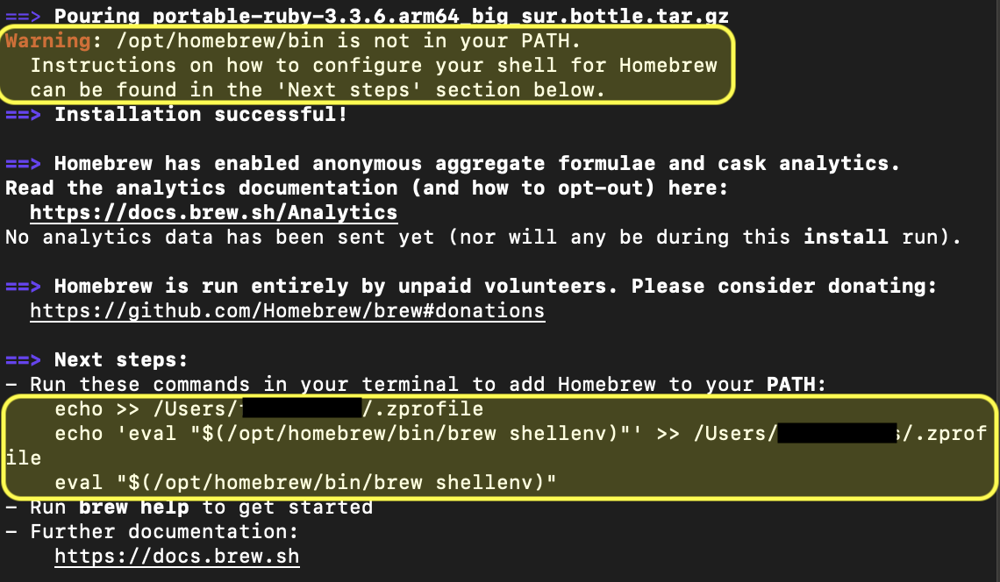

# packages and tools for Workspace 

> ### gcc 

Used to compile c (to use on WSL kali linux, but it's not specific 
it can be used in Ubuntu too, it's linux like))

#### linux
```sh
sudo apt install build-essential
```

> ### brew

The Missing Package Manager for macOS (or Linux)

see the command here (is always latest):
https://brew.sh

##### Warning
 
don't forget to add brew to path (to use brew command everywhere) with the last 3 commands after the done installation
(everything are writen there, i can't write theses commands here because it's vary on the system you are and your computer name)
this way (copy and past to terminal theses 3 commands):



> ### Docker

this method can be done in any OS with a sh terminal
there is the same method with apt package manager but to make things
timple we instead use brew for every OS (because it's same)

- requirements : brew (home brew)

you just need to install docker now from brew
```sh
brew install docker
```

- to run docker

you must "start" the app 

```sh
open -a docker
```

if it's not working you can install Docker Desktop
and retry (from terminal) or click the button on the app directly

> ### use Kali Linux docker image

```sh
docker pull kalilinux/kali-rolling
```
[can be found here](https://hub.docker.com/r/kalilinux/kali-rolling)

> ### install TS (typescript to transpile JS)

```sh
brew install typescript
```

<!-- end -->
