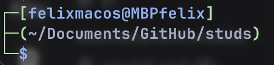

# Zsh/Bash configuration file for terminal

#### Customization level 2 (without external app)

> [!INFO]
> for both .zshrc and .bashrc hidden files

$PS1 (Kali style)
(zsh like)

```bash
PROMPT_SHELL=${SHELL:t}
PS1=$'%B%F{green}┌─%F{green}(%F{blue}%n@%m%F{green})-[%F{white}%~%f%F{green}]\n%F{green}└─%F{blue}$ %F{white}%b'
```
(exact Kali)
<hr>
custom style (reload with cmd "$SHELL" in terminal)

```bash
# ~/.shell_prompt
if [ -n "$ZSH_VERSION" ]; then
  # Zsh (tested on real linux cli)
  line1=$'%{%B%F{green}%}┌─[%%n@%m%]%{%f%b%}\n'
  line2=$'%├─(%%~%)%\n'
  line3=$'%└─%$ %'
  PS1="$line1$line2$line3"
elif [ -n "$BASH_VERSION" ]; then
  # Bash (tested on real linux cli)
  line1="\[\e[1;32m\]┌─\[\e[1;32m\]\n"
  line2="(\[\e[34m\]\u@\h\[\e[32m\])-[\[\e[37m\]\w\[\e[32m\]])\n"
  line3="└─\[\e[34m\]\$ \[\e[0m\]"
  PS1="$line1$line2$line3 "
fi
```


#### customization level 3 (with external tools)


