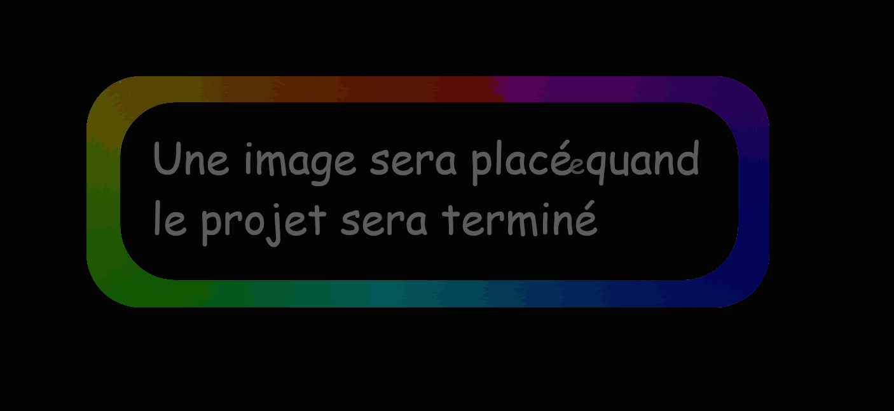

Le(s) code(s) suivant(s) sont fait en <u><b> PYthon </b></u>
<div>
<title>voici une image de présentation quand le projet sera terminé : </title>
</div>

 

fichier d'explication sur le projet de La Nuit Du Code présenté ci-dessous :
## La nuit du code (6h de codage non-stop):
- projet sur le jeu de la vie (automate cellulaire)
- <u>**__Récapitulatif des choses à faire :__**</u>

    - changer la taille de l'image sans modifier la taille des pixels (...mais en modifiant la quantité des pixels dans l'image
    en fonction de la taille de celle-ci, et pouvoir faire ça pendant que la simulation est en cours, même
    si ça va quelque peut perturber l'image en la figeant lors du changement de taill mais c'est pas trés grave ça ne
    stoppera pas le code)

    - afficher une deuxième feuniètre qui sera un fichier enregistré dans lequel on pourras crééer des modèles de cellules
    et les enregistrer dirrectement dans le fichier
    - on pourra placer les formes géométriques dirrectement sur l'image
    - on pourras générer les modèles enregistrés dirrectement dans le screen, en les ajoutants facilement.
    - on pourra triser les formes enregistrés en les plaçant dans une liste vertical on pourras intervertir ou déplacer des 
    éléments de la liste (exemple l'élément 5 de la liste on le met au 10)
    - on pourras ajouter certains éléments de la liste dans une autre liste qui représentera les favoris
    - on pourra utiliser une molète pour avoir la main sur la vitesse de génération
    - on pourra voir le nombre de génération (chaque tours)
    - on pourra changer les règles de vie des cellules (les tuer ou les maintenir en vie)
    - (si on y arrive) on pourras automatiser un test de remplissage de cellules au coup par coups (trés long) qui nous permettras d'étudier 
    la majorités (ou toutes) les configurations des cellules (exemple on commence avec 1 cellule, puis 2, puis 2, puis 3 a des positions différentes
    donc on aura jamais deux fois la même configuration, sauf par symétrie, ce qui est normal)
    - (non prioritaires) on pourra éventuellement stacker les priorités sur les figures géométriques (exemple : 1 carrés qui a plusieurs
    vies peut continuer a vivre a la prochaine génération mais perdra une vie et quand il n'a plus de vie
    en fonction des régle du jeu il peut mourir)
    - (si on y arrive) on aura un système de langues intégré dans la simulation de l'automate cellulaire (dans la deuxième fenètre de management)
    - (non prioritaire) on pourra avoir un apperçut des enregistrements de la liste des éléments que l'on
    aura fait au préalable (pour voir avant de lancer le simulation la configuration des cellules)
    - (non prioritaire) on pourra connaitre le temps d'execution des générations.
    - (si le temps) on pourra dirrectementse positionner a une date de génération
    - (si le temps) on pourra utiliser d'autres formes 
    - (si le temps) pourra faire des comapraisons de générations ou de modèles (avec du commenté)
    - (si le temps) on pourra changer la dimenstion de l'exécution pour avoir par exemple des plans verticaux 
      au lieue d'avoir du 2d qui s'exécute sur toute l'image ou pourrait par exemple avoir du 1d qui s'execute sur
      une seule ligne et qui a la génération suivante passe a la ligne suivante.
    - => idées à venir ...


### Les modules à importer (que l'on aura installé préalablement):
```py
import pyxel  # module principal
from random import randint

# au cas ou : (voir le code tout y est)
import pygame
import pyplot as plt # aller voir le vrai nom
import numpy as np
import tkinter

```
module pyxel de Pypi (doc sur internet a voir mais pas trés intéressantes)


######end page